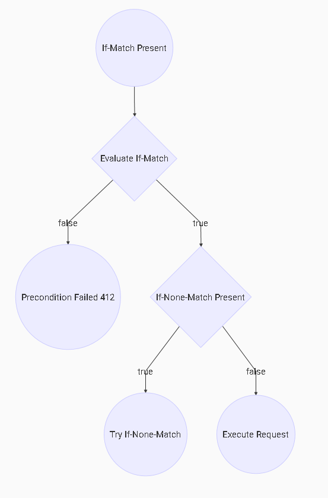
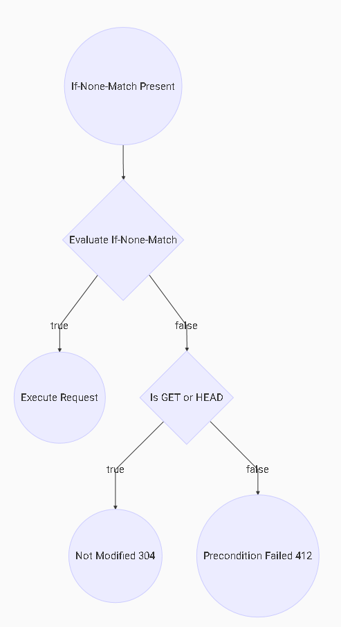

# ETags and Optimistic Locking

The ETag response-header field provides the current value of the entity. This may be used in conjunction with If-Match and If-None-Match headers to implement
 an optimistic locking process.
 
 The headers may be used in conjunction with the following HTTP Verbs

| HTTP Verb     | ETag (Response) | If-Match (Request) | If-None-Match (Request) |
|---------------|-----------------|--------------------|-------------------------|
| GET           | Y               | Y                  | Y                       |
| HEAD          | Y               | Y                  | Y                       |
| POST          | Y               | Y                  | Y                       | 
| PUT           | Y               | Y                  | Y                       |
| DELETE        |                 | Y                  | Y                       |
| TRACE         |                 |                    |                         |
| CONNECT       |                 |                    |                         |
| OPTIONS       |                 |                    |                         |
| PATCH         | Y               | Y                  | Y                       |

For full information on the exact useage see [RFC-7232](https://tools.ietf.org/html/rfc7232#section-3.1)

## How to Evaluate If-Match
````
if (field=='*') and (record does not exist) return false;
if (field doesn't match record) return false;
return true
````

## How to Evaluate If-None-Match
````
if (field=='*') and (record exists) return false;
if (field matches record) return false;
return true
````

## Precedence


| First Operation                             | Second Operation                                      |
|:-------------------------------------------:|:-----------------------------------------------------:|
|  |  |


## GET

Retrieve en entity identified by the Request-URI

### If-Match

| Header          | Precondition | Entity Exists | Action                |
|-----------------|--------------|---------------|-----------------------|
| If-Match        | False        | -             | 412                   |
| If-Match        | True         | -             | If-None-Match or Exec |

### If-None-Match

Make mandatory if efficient retrieval required (304)

| Header          | Precondition | Entity Exists | Action                |
|-----------------|--------------|---------------|-----------------------|
| If-None-Match   | True         | -             | Exec                  |  
| If-None-Match   | False        | -             | 304                   |

### Exec

| Header          | Precondition | Entity Exists | Action                |
|-----------------|--------------|---------------|-----------------------|
| -               | -            | N             | 404                   |
| -               | -            | Y             | Return Entity/200     |

## HEAD

Retrieves the header information of a resource. As per GET but do not return body

### If-Match

| Header          | Precondition | Entity Exists | Action                |
|-----------------|--------------|---------------|-----------------------|
| If-Match        | False        | -             | 412                   |
| If-Match        | True         | -             | If-None-Match or Exec |

### If-None-Match

Make mandatory if efficient retrieval required (304)

| Header          | Precondition | Entity Exists | Action                |
|-----------------|--------------|---------------|-----------------------|
| If-None-Match   | True         | -             | Exec                  |  
| If-None-Match   | False        | -             | 304                   |

### Exec

| Header          | Precondition | Entity Exists | Action                |
|-----------------|--------------|---------------|-----------------------|
| -               | -            | N             | 404                   |
| -               | -            | Y             | 204     |


## POST

Most often utilized to create new resources. E.g. adding items to a collection.  **NOT IDEMPOTENT** 

Make If-Match mandatory if optimistic locking is in use

### If-Match

| Header          | Precondition | Entity Exists | Action                |
|-----------------|--------------|---------------|-----------------------|
| If-Match        | False        | -             | 412                   |
| If-Match        | True         | -             | If-None-Match or Exec |

### If-None-Match

| Header          | Precondition | Entity Exists | Action                |
|-----------------|--------------|---------------|-----------------------|
| If-None-Match   | True         | -             | Exec                  |  
| If-None-Match   | False        | -             | 412                   |

### Exec

| Header          | Precondition | Entity Exists | Action                |
|-----------------|--------------|---------------|-----------------------|
| -               | -            | N             | 201                   |
| -               | -            | Y             | 200 or 409 (*)        |

(*) Dependent on result of POST operation to the resource  


## PUT

Can be used to:

1.  To create a resource in the case where the resource ID is chosen by the client 
2.  To update a known resource with the request body containing the newly-updated representation of the original resource

Make If-Match mandatory if optimistic locking is in use

### If-Match

| Header          | Precondition | Entity Exists | Action                |
|-----------------|--------------|---------------|-----------------------|
| If-Match        | False        | -             | 412                   |
| If-Match        | True         | -             | If-None-Match or Exec |

### If-None-Match

| Header          | Precondition | Entity Exists | Action                |
|-----------------|--------------|---------------|-----------------------|
| If-None-Match   | True         | -             | Exec                  |  
| If-None-Match   | False        | -             | 412                   |

### Exec

| Header          | Precondition | Entity Exists | Action                |
|-----------------|--------------|---------------|-----------------------|
| -               | -            | N             | 201                   |
| -               | -            | Y             | 200 or 409 (*)        |

(*) Dependent on result of PUT operation to the reosurce  

## PATCH

Used to update an existing resource

Make If-Match mandatory if optimistic locking is in use

### If-Match

| Header          | Precondition | Entity Exists | Action                |
|-----------------|--------------|---------------|-----------------------|
| If-Match        | False        | -             | 412                   |
| If-Match        | True         | -             | If-None-Match or Exec |

### If-None-Match

| Header          | Precondition | Entity Exists | Action                |
|-----------------|--------------|---------------|-----------------------|
| If-None-Match   | True         | -             | Exec                  |  
| If-None-Match   | False        | -             | 412                   |

### Exec

| Header          | Precondition | Entity Exists | Action                |
|-----------------|--------------|---------------|-----------------------|
| -               | -            | N             | 409                   |
| -               | -            | Y             | 200 or 409 (*)        |

(*) Dependent on result of POST operation to the reosurce  


## DELETE

Delete a resource

Make If-Match mandatory if optimistic locking is in use

### If-Match

| Header          | Precondition | Entity Exists | Action                |
|-----------------|--------------|---------------|-----------------------|
| If-Match        | False        | -             | 412                   |
| If-Match        | True         | -             | If-None-Match or Exec |

### If-None-Match

| Header          | Precondition | Entity Exists | Action                |
|-----------------|--------------|---------------|-----------------------|
| If-None-Match   | True         | -             | Exec                  |  
| If-None-Match   | False        | -             | 412                   |

### Exec

| Header          | Precondition | Entity Exists | Action                |
|-----------------|--------------|---------------|-----------------------|
| -               | -            | N             | 204                   |
| -               | -            | Y             | 204                   |


